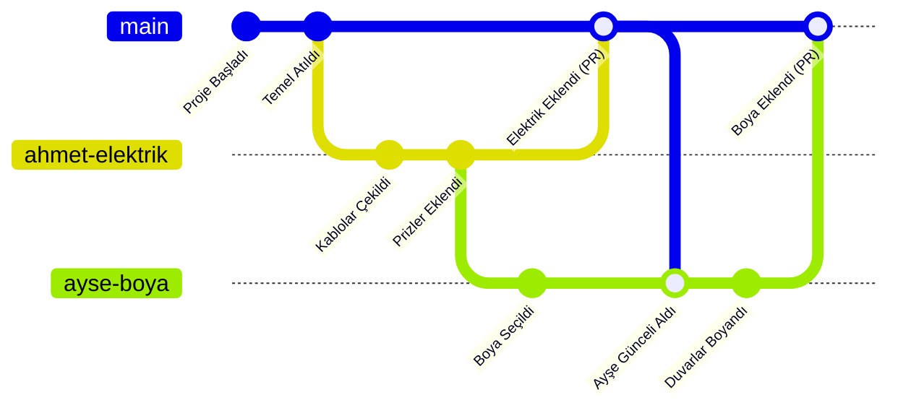

# Aynı Projede Birlikte Çalışma Mantığı (Git & GitHub)

Bir yazılım projesinde aynı anda birden fazla kişinin çalışması, "Aynı Word dosyasını 5 kişinin aynı anda düzenlemeye çalışması" gibidir. Eğer önlem alınmazsa, herkes birbirinin yazdığını siler.

Yazılım dünyasında bu sorunu **Git** (Versiyon Kontrol Sistemi) ve **GitHub** (Bu versiyonların tutulduğu bulut deposu) ile çözeriz.

Hadi bu mantığı basit bir benzetme ile oturtalım.

---

## 🏗️ Benzetme: "İnşaat Sahası ve Mimari Plan"

Diyelim ki bir **Bina (Proje)** inşa ediyoruz.
1.  **Ana Plan (Main Branch):** Şantiyenin ortasında duran, herkesin gördüğü, *onaylanmış* ve *sağlam* olan tek bir mimari çizim vardır. Buna teknikte **`main` (veya `master`) dalı** denir.
2.  **Kişisel Kopyalar (Local Branches):**
    *   **Ahmet** elektriği döşeyecek. Ana plana gidip üzerine çizim *yapmaz*. Ana planın **bir fotokopisini** (Clone/Branch) alır, kendi masasına (Bilgisayarına) götürür.
    *   **Ayşe** duvarları boyayacak. O da gider ana planın bir fotokopisini alır.

Ahmet kendi fotokopisinde elektriği çizerken hata yaparsa, ana plan (Main) bozulmaz. Ayşe de kendi kağıdında istediği gibi dener.

### Birleştirme (Merge) Anı
Ahmet işini bitirdiğinde Şantiye Şefine (Proje Yöneticisi) gelir:
> *"Şefim, ben elektriği çizdim, benim kağıdımdaki çizimi ana plana aktaralım."*

Şef (veya ekip arkadaşları) bakar:
*   Elektrik kabloları su borularıyla çakışıyor mu? (Conflict)
*   Her şey doğru mu? (Code Review)

Eğer sorun yoksa, Ahmet'in kağıdı **Ana Plan** ile birleştirilir. Artık Ana Plan'da elektrik tesisatı da vardır. Ayşe işini bitirip geldiğinde, onun çizimleri de bu "yeni ve elektrikli" ana planın üzerine eklenir.

---

## 💻 Teknik İşleyiş (Adım Adım)

Bu işin teknik olarak nasıl yapıldığını görselleştirelim:

### 1. `Main` (Ana Dal) - Kutsal Kase 🏆
Bu dalda her zaman **çalışan** kodlar durur. "Hadi şunu deneyeyim" diyip buraya kod yazılmaz.

### 2. `Branch` (Dal) Açmak - Kendi Masan 🎋
Bir özellik ekleyeceğin zaman kendine özel bir çalışma alanı yaratırsın.
*   Komut: `git checkout -b barkod-ozelligi`
*   Anlamı: *"Ana projeden bir kopya al, adını 'barkod-ozelligi' koy ve beni oraya götür."*

### 3. `Commit` (Kaydetmek) - Fotoğraf Çekmek 📸
Kodunda bir değişiklik yaptığında (örneğin bir dosyayı düzenledin), bunu paketleyip mühürlemen gerekir.
*   Komut: `git add .` (Değişiklikleri seç)
*   Komut: `git commit -m "Barkod okuyucu eklendi"` (Paketle ve üzerine not yapıştır)

### 4. `Push` (Yollamak) - Buluta Göndermek ☁️
Senin bilgisayarında yaptığın bu değişiklikleri, diğerlerinin görmesi için GitHub'a yollarsın.
*   Komut: `git push origin barkod-ozelligi`

### 5. `Pull Request` (PR) - "Benimkini Ekle" İsteği 🤝
GitHub sitesine gidip *"Arkadaşlar ben 'barkod-ozelligi' dalında işimi bitirdim, ana projeye (main) ekler misiniz?"* dersin. Buna **Pull Request** denir.
Ekip arkadaşların koduna bakar ("Burada hata var", "Şurayı şöyle yazsan daha iyi" der). Onay verilince "Merge" butonuna basılır ve senin kodun herkesin kullandığı ana projeye dahil olur.

---

## ❓ En Sık Sorulan Sorular

**Soru: Ya aynı dosyayı aynı anda değiştirirsek? (Conflict)**
**Cevap:** Diyelim ki sen A dosyasının 10. satırını değiştirdin, arkadaşın da aynı dosyanın 10. satırını değiştirdi.
Git, birleştirme sırasında size sorar: *"İkiniz de burayı değiştirdiniz. Hangisini kabul edeyim? Yoksa ikisini birleştirip yeni bir cümle mi kuralım?"* Buna **Conflict (Çakışma)** denir. Manuel olarak seçip düzeltirsiniz.

**Soru: Arkadaşım ana projeyi güncelledi, ben geride kaldım. Ne yapacağım?**
**Cevap:** Sabah işe başlamadan önce her zaman `git pull` komutunu kullanarak ana projedeki son değişiklikleri (arkadaşının dün gece eklediği şeyleri) kendi bilgisayarına çekersin. Böylece her zaman güncel kalırsın.
